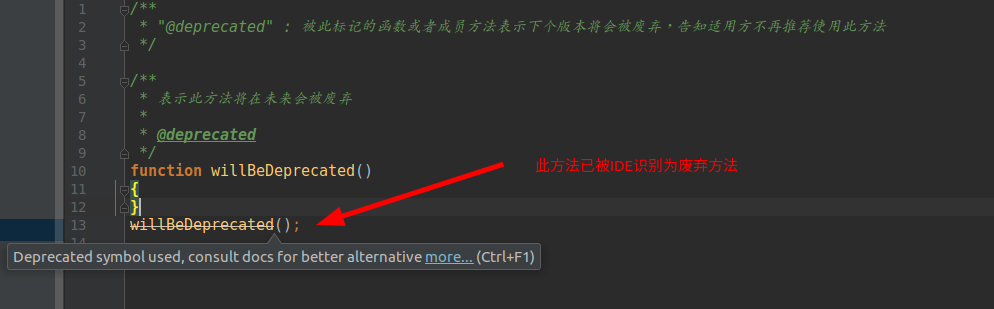
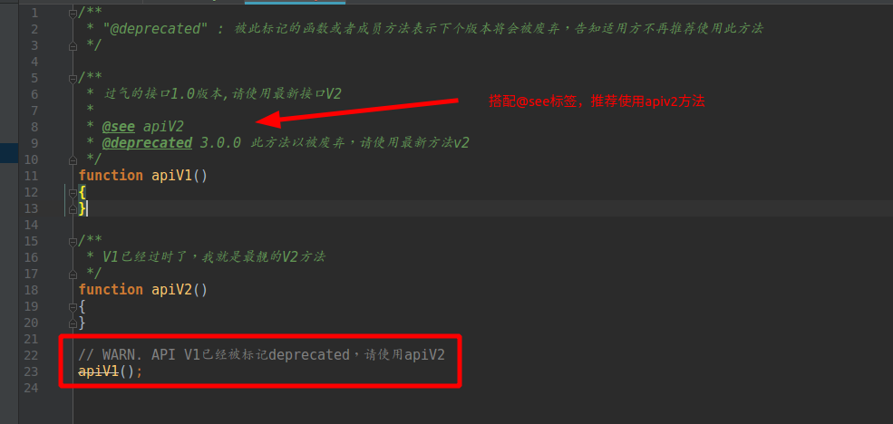

# @deprecated

`@deprecated` : 被此标记的函数或者成员方法表示下个版本将会被废弃，告知适用方不再推荐使用此方法.

**此标签推荐使用PhpStorm/WebStorm进行阅读,可以能直观体现标签的作用**

## 语法

> `@deprecated [<some text>]`

## 描述

- 如果被标记的方法只是因为被其他新方法代替而被废弃，可以结合`@see`来表示被代替的方法

## 标签效果

### 废弃标签

### 搭配@see

