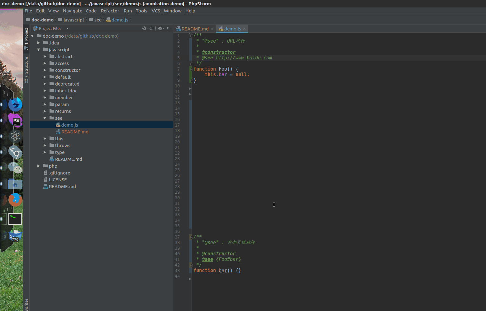

# @see

`@see` : 此标签表示可以参考另一个标识符的说明文档，或者一个外部资源。

**此标签推荐使用PhpStorm/WebStorm进行阅读,可以能直观体现标签的作用**

## 语法

- `@see <namepath>`
- `@see <url>`

## 标签效果

动图演示内容

1.通过@see标记的{Foo#bar}，可以进行跳转到Foo类中的bar成员属性中
2.通过点击@see标记的外部链接[http://www.baidu.com](http://www.baidu.com)，可跳转到浏览器中查看  

