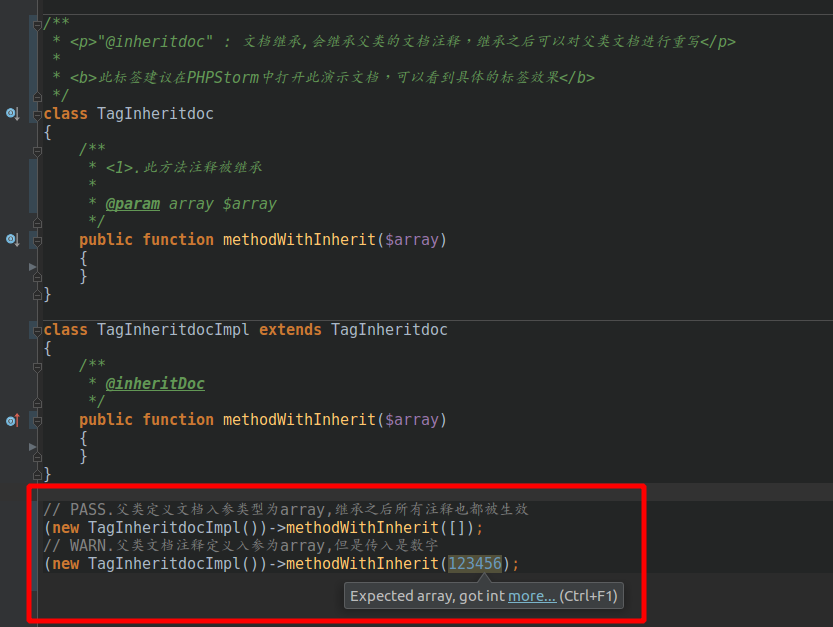
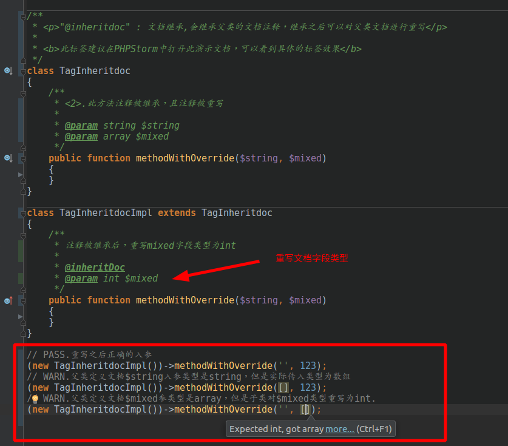

@inheritdoc
=======

`@inheritdoc` : 文档继承,会继承父类的文档注释.

**此标签推荐使用PHPstorm进行阅读,可以能直观体现标签的作用**

语法
=======

> `@inheritDoc`

描述
=======

- `@inheritDoc`会继承父类的所有文档注释

标签效果
=======

1.直接继承
=======

2.继承重写
=======

