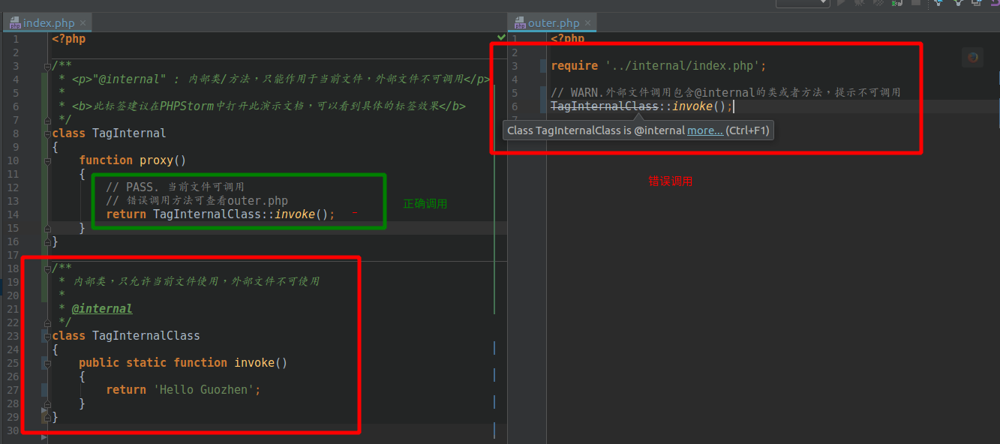

@internal
=======

`@internal` : 内部类/方法，只能作用于当前文件，外部文件不可调用.

**此标签推荐使用PhpStorm进行阅读,可以能直观体现标签的作用**

语法
=======

> `@internal [description]`

使用场景
=======

此标签通常可使用在单元测试中，比如在单元测试中定义了一个测试用的类，可对此测试类添加`@internal`标签，这样别人在正常逻辑中万一不小心错误引用了测试类，在IDE的帮助下，可以第一时间得到反馈.

标签效果
=======

