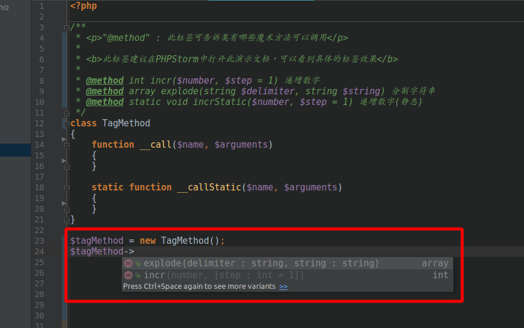
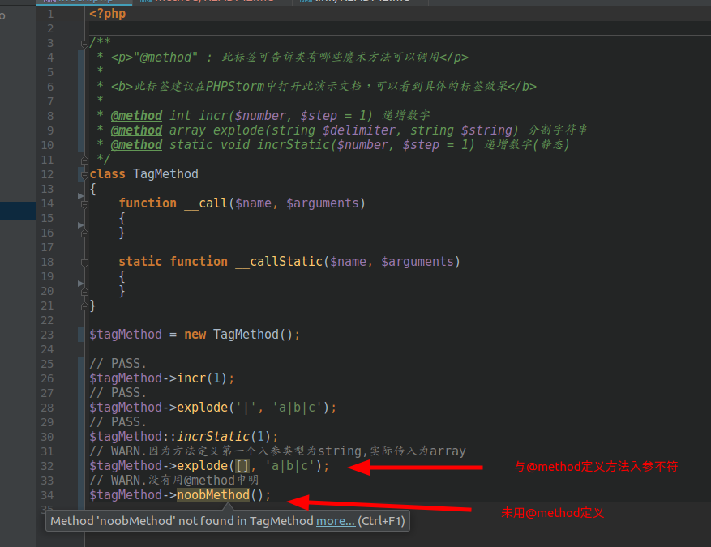

@method
=======

`@method` : 此标签可告诉类有哪些魔术方法可以调用.

**此标签推荐使用PhpStorm进行阅读,可以能直观体现标签的作用**

语法
=======

> `@method [modifier] [return type] [name]([[type] [parameter]<, …>]) [<description>]`

使用场景
=======
当一个类用魔术方法`__call`去代理执行类成员方法时，对于调用方来讲是很迷茫的，因为调用方是无法知道具体有哪些方法可以调用.
而**@method**正好可以解决这个问题，可以事先在注释中定义可调用的方法列表，对于调用方来说也会非常清晰．

标签效果
=======

IDE自动提示
=======

最终效果
=======

