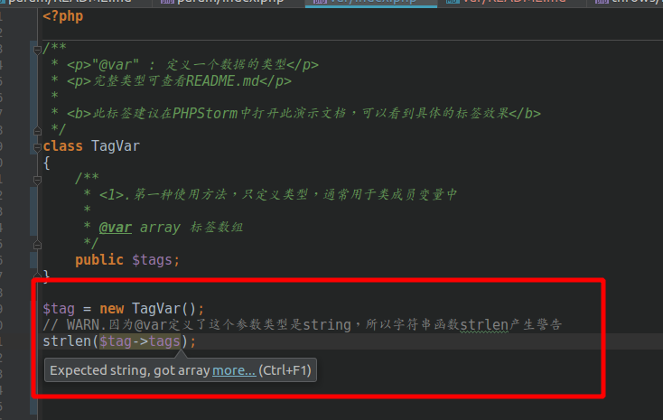
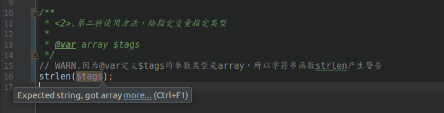

@var
=======

`@var` : 定义一个数据的类型.

**此标签推荐使用PhpStorm进行阅读,可以能直观体现标签的作用**

语法
=======

> `@var [Type] [$element_name] [<description>]`

变量列表
=======
| 变量类型 | 说明 |
|---|---|
|string | 字符串|
|integer/int | number/int类型 |
|boolean/bool | false/true |
|float/double | number/浮点数 |
|object | 对象实例|
|specifiedType | 指定类 |
|mixed | 任意类型|
|array/specifiedType[] | 数组，可以指定成指定类型的数组|
|resource | 文件资源类型|
|void | 无返回值|
|null | -|
|callable | 可执行的回调函数|
|function | 不一定能执行的方法|
|self/$this | 当前实例|

标签效果
=======

实现@var可以有两种使用方法

1.在类成员变量中定义，不需要指定变量名称
=======

2.直接给具体变量定义，需要指定变量名称
=======

